<div align="right">

[](https://bundlephobia.com/package/andern@latest)
[](https://www.npmjs.com/package/andern)
[](https://github.com/loreanvictor/andern/actions/workflows/coverage.yml)

</div>


`ändern` helps with tracking changes across an object tree. Use it to wrap and modify an object, and you'd get [observables](https://rxjs.dev/guide/observable) notifying you when [some part of the object](https://datatracker.ietf.org/doc/html/rfc6901) changes, and [what the changes are](https://jsonpatch.com).

```js
import { createRoot } from 'andern'

const root = createRoot({
  people: [
    { name: 'John', age: 20 },
    { name: 'Jane', age: 21 },
  ]
})

// 👇 subscribe to a part of the tree
root.child('/people/1').subscribe(console.log)

// 👇 manually set a specific part of the tree
root.child('/people/1/age').set('', 32)

// 👇 apply a patch to a specific part of the tree
root.child('/people').patch({ op: 'remove', path: '/1/age' })

```

<div align="right">

[**▷ TRY IT**](https://codepen.io/lorean_victor/pen/VwVoOdM?editors=0012)

</div>

<br>

# Contents

- [Contents](#contents)
- [Installation](#installation)
- [Usage](#usage)
- [Advanced Usage](#advanced-usage)
- [Contribution](#contribution)

<br>

# Installation

[Node](https://nodejs.org/en/):

```bash
npm i andern
```

Browser / [Deno](https://deno.land):

```js
import { createRoot } from 'https://esm.sh/andern'
```

<br>

# Usage

`ändern` helps with propagating and tracking changes across some object (for example, managing application state). It treats the object as a tree: the root represents the whole object, and child nodes representing various parts of it. You can subscribe to different parts of the tree, modify or patch them, etc, and `ändern` will make sure that all changes are propagated exactly to the correct subscribers.


👉 Create a root node:
```js
import { createRoot } from 'andern'

const root = createRoot({
  people: [
    { name: 'John', age: 20 },
    { name: 'Jane', age: 21 },
  ]
})
```
<br>

👉 Get a child node:
```js
const john = root.child('/people/0')
```

> Child nodes are specified in [JSON Pointer](https://gregsdennis.github.io/Manatee.Json/usage/pointer.html) format.

<br>

👉 Subscribe to a node's values:
```js
john.subscribe(console.log)
root.child('/people/1').subscribe(console.log)
```

> Each node is an [observable](https://rxjs.dev/guide/observable) that emits the current value of the node whenever it changes.

<br>

👉 Update the node:
```js
john.set('/name', 'Johnny')
```
```js
john.add('/title', 'Dr.')
```
```js
john.remove('/age')
```

> To change the whole object, use `''` as the path. Alternatively, you can use `node.next(...)`, as each node is also an [observer](https://rxjs.dev/guide/observer).

<br>

👉 Subscribe to its changes:
```js
john.patches.subscribe(console.log)
```

👉 Apply a patch:
```js
john.patch({ op: 'replace', path: '/name', value: 'Johnny' })
```

> Changes are expressed in [JSON Patch](https://jsonpatch.com) format.

<br>

👉 Use `.read()` method to get readonly nodes:

```js
const john = root.read('/people/0')
```

<br>

# Advanced Usage

The core construct of `ändern` is the `Node` class. It represents a node in the tree, and is responsible for propagating changes to its subscribers.

```ts
class Node<T>
  extends Observable<T>
  implements Observer<T> {

  constructor(
    initial:  T,
    downstream: Observable<Patch>,
    upstream: Observer<Patch>,
  );

  read(path: string): ReadonlyNode<T>;
  child(path: string): Node<T>;
  patch(patch: Patch | Operation): this;
  set(path: string, value: any): this;  
  remove(path: string): this;

  // and some inherited methods
}
```

For creating a `Node`, you need an initial value, an _upstream_ and a _downstream_:

- _downstream_ is an observable of patches, determining changes that should be applied to the node's value, and propagated to its children.
- _upstream_ is an observer of patches. When changes are applied to the node, they are propagated to the upstream, so that all affected nodes are notified.

The node's value is patched ONLY when a patch comes down the downstream. Invoking `.set()`, `.patch()` or `.remove()` methods merely sends a patch upstream and DOES NOT apply it to the value of the node. The changes are then bounced back at the root of the tree and down-propagated to all affected nodes, including the node that initiated the change. This allows for custom upstream behavior that conducts validation and discards invalid changes.

This is how the root node is created (via `createRoot()`):

```ts
function createRoot<T>(value: T) {
  // 👇 this subject emits any incoming patches.
  const echo = new Subject<Patch>()
  const root = new Node(value, echo, echo)

  return root
}
```

A child node is created by minor modifications to the up and downstreams of the parent node. Patches coming from child nodes will have their path attached to their operations before being up-propagated. Patches coming from downstream will first be checked to match the child node's path, and then have their path stripped before being down-propagated.

👉 [**See this in action**](https://codepen.io/lorean_victor/full/vYvBZKa).

<div align="center">

</div>

> -  a patch is applied to observer #2.
> -  observer #2 up-propagates the following patch to its parent, observer #1:
>    ```json
>    { "path": "", "op": "replace", "value": 32 }
>    ```
> -  observer #1 up-propagates a similar patch with updated path to its parent, the root node:
>   ```json
>   { "path": "/0/age", ... }
>   ```
> -  root up-propagates a similar patch with updated path:
>   ```json
>   { "path": "/people/0/age", ... }
>   ```
> -  the patch is echoed back to root.
> -  root notifies all subscribers of change.
> -  root down-propagates similar patches with altered paths to its children, observer #3 and observer #1, respectively:
>   ```json
>   { "path": "/age", ... }
>   ```
>   ```json
>   { "path": "/0/age", ... }
>   ```
> -  observers #3 and #1 notify their subscribers of change.
> -  observer #1 down-propagates a similar patch with altered path to its child, observer #2:
>   ```json
>   { "path": "", ... }
>   ```
> -  observer #2 notifies its subscribers of change.

<br>

# Contribution

You need [node](https://nodejs.org/en/), [NPM](https://www.npmjs.com) to start and [git](https://git-scm.com) to start.

```bash
# clone the code
git clone git@github.com:loreanvictor/andern.git
```
```bash
# install stuff
npm i
```

Make sure all checks are successful on your PRs. This includes all tests passing, high code coverage, correct typings and abiding all [the linting rules](https://github.com/loreanvictor/andern/blob/main/.eslintrc). The code is typed with [TypeScript](https://www.typescriptlang.org), [Jest](https://jestjs.io) is used for testing and coverage reports, [ESLint](https://eslint.org) and [TypeScript ESLint](https://typescript-eslint.io) are used for linting. Subsequently, IDE integrations for TypeScript and ESLint would make your life much easier (for example, [VSCode](https://code.visualstudio.com) supports TypeScript out of the box and has [this nice ESLint plugin](https://marketplace.visualstudio.com/items?itemName=dbaeumer.vscode-eslint)), but you could also use the following commands:

```bash
# run tests
npm test
```
```bash
# check code coverage
npm run coverage
```
```bash
# run linter
npm run lint
```
```bash
# run type checker
npm run typecheck
```
